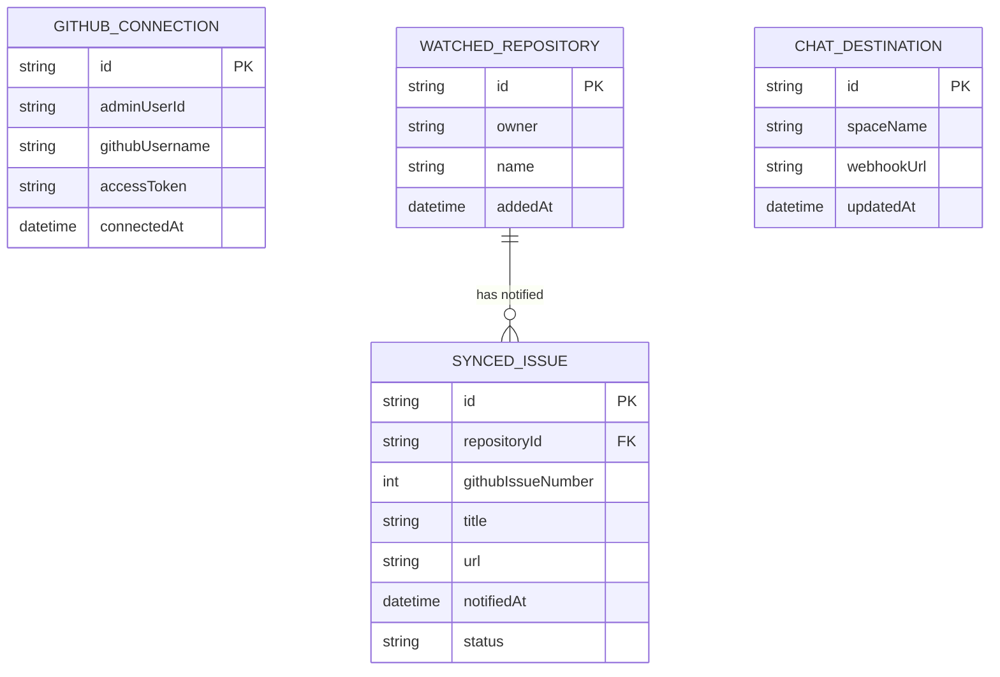

# Domain Model

The system tracks which GitHub repositories are watched, the Administrator's GitHub authorization, the Google Chat destination, and a record of each critical issue already notified on (so no issue is ever posted twice).

- **GitHubConnection** — the Administrator's GitHub OAuth authorization; its token is what the poller uses to read issues on watched repositories.
- **WatchedRepository** — one entry per repository the Administrator has added to the watch list.
- **ChatDestination** — the single configured Google Chat space (webhook) notifications are posted to.
- **SyncedIssue** — one row per critical issue already notified on, keyed by repository + GitHub issue number, so a repeat poll never sends a duplicate; `status` records whether the notification succeeded.

