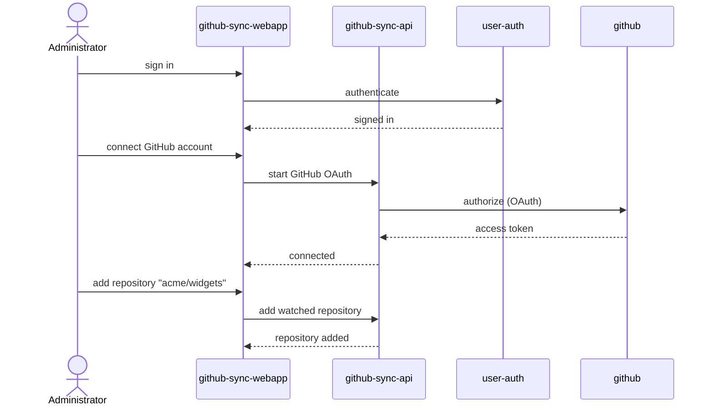

# Connect GitHub and Watch a Repository

The Administrator signs in, authorizes GitHub access, and adds a repository to the watch list.

```mermaid
sequenceDiagram
    actor Administrator
    participant github-sync-webapp
    participant github-sync-api
    participant user-auth
    participant github

    Administrator->>github-sync-webapp: sign in
    github-sync-webapp->>user-auth: authenticate
    user-auth-->>github-sync-webapp: signed in

    Administrator->>github-sync-webapp: connect GitHub account
    github-sync-webapp->>github-sync-api: start GitHub OAuth
    github-sync-api->>github: authorize (OAuth)
    github-->>github-sync-api: access token
    github-sync-api-->>github-sync-webapp: connected

    Administrator->>github-sync-webapp: add repository "acme/widgets"
    github-sync-webapp->>github-sync-api: add watched repository
    github-sync-api-->>github-sync-webapp: repository added
```