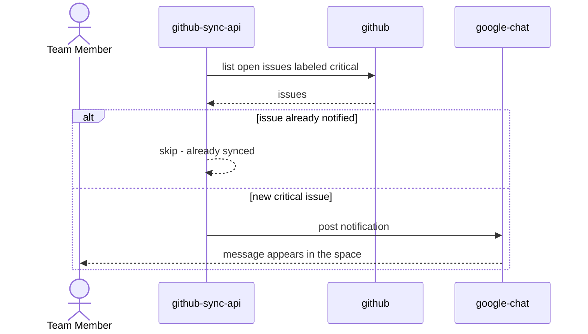

# Critical Issue Notification

The system polls each watched repository, and posts a Google Chat message the moment a new critical issue is found — never twice for the same issue.

```mermaid
sequenceDiagram
    actor TeamMember as Team Member
    participant github-sync-api
    participant github
    participant google-chat

    github-sync-api->>github: list open issues labeled critical
    github-->>github-sync-api: issues

    alt issue already notified
        github-sync-api-->>github-sync-api: skip - already synced
    else new critical issue
        github-sync-api->>google-chat: post notification
        google-chat-->>TeamMember: message appears in the space
    end
```